# Business_Inventory
 
PURPOSE: To create an MDI app that uses menus; list boxes; and a user control; to input and output to serialized files.  

PROBLEM: Inventory Program  
You are the owner of two businesses – a hardware store and an office supply store. You need a 
program to keep an inventory of the different items you sell in each store, how many of each item 
are currently in stock and the cost of each. Write a program that lets you load (input) data from a 
file relating to each item for a particular store. It should enable you to list all your items in that 
store, let you delete an item that you no longer have; let you add a new item; and let you update 
information. It should save the changes to a file (essentially rewriting over the original file). The 
program should be an MDI – the child windows will correspond to the two different inventory lists 
of your businesses.  

You are to create a main menu with at least three menus:  
File menu with commands Open, Save, and Exit;  
an Edit menu with Insert, Delete, and Update commands;  
and an About menu.  

You will want some security for your system, so you will need to create a UserControl for 
LoginPswdUserControl. That control should contain a label that displays “Login:”; a TextBox where 
the user inputs a login name, a Label that displays the “Password:” and, finally, a TextBox where 
the user inputs a password (do not forget to set property PasswordChar to “*” in the properties 
window). LoginPswdUserControl must provide public read-only properties Login and Password that 
allow an application to retrieve the user input from the login TextBox and the password TextBox. 
You won’t be “verifying” the login and password, however. Enable the main menus only after the 
user has logged in.
 
 
 
 
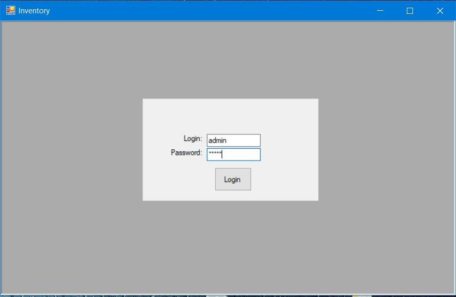
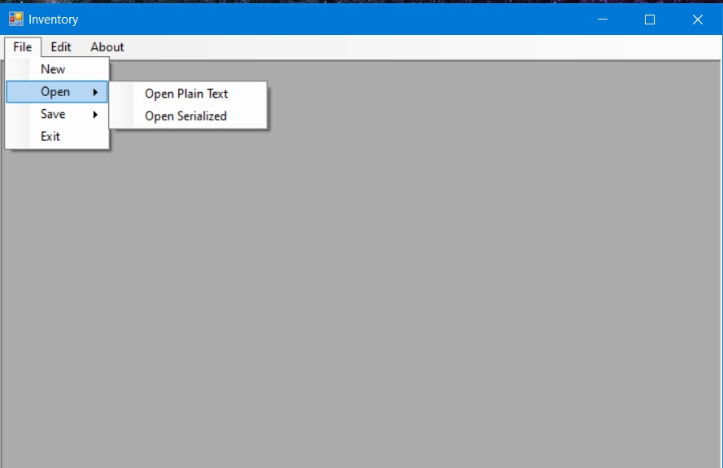
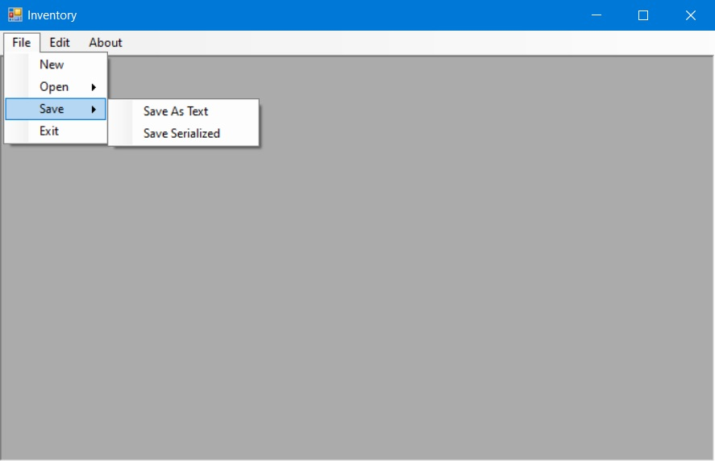
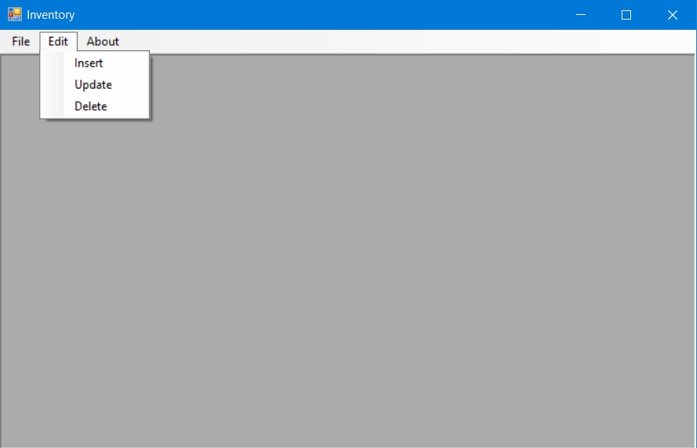
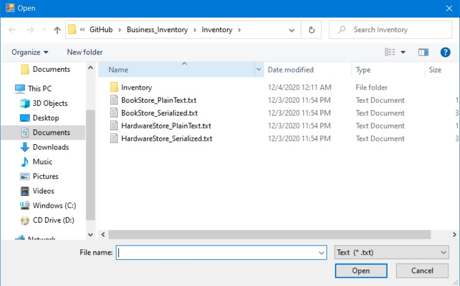
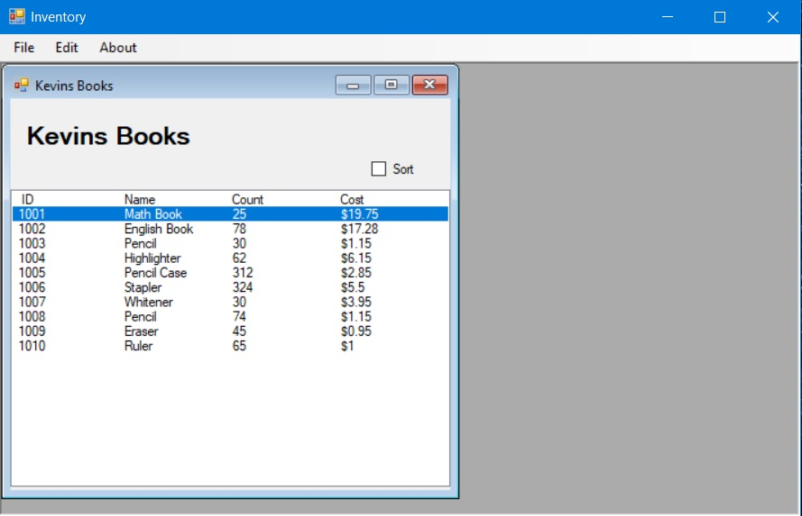
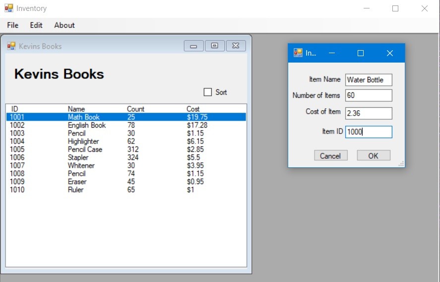
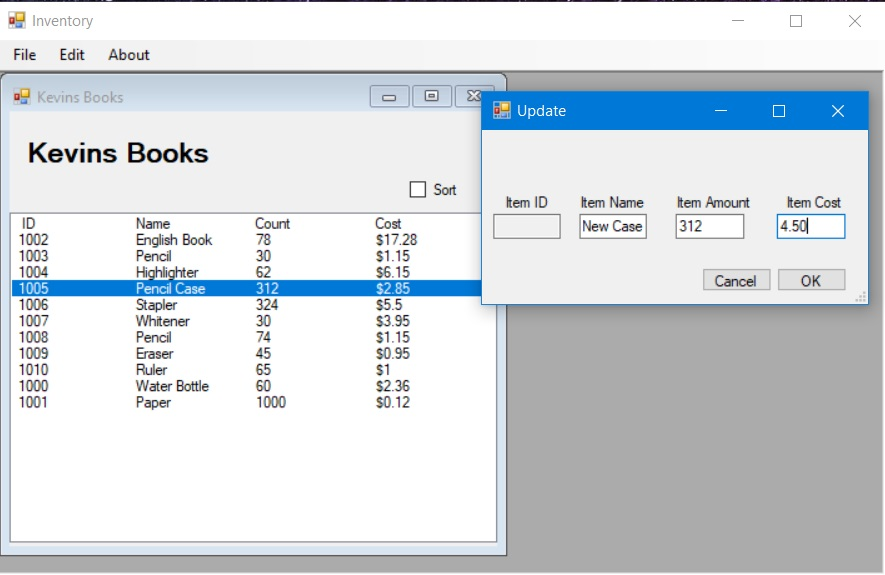
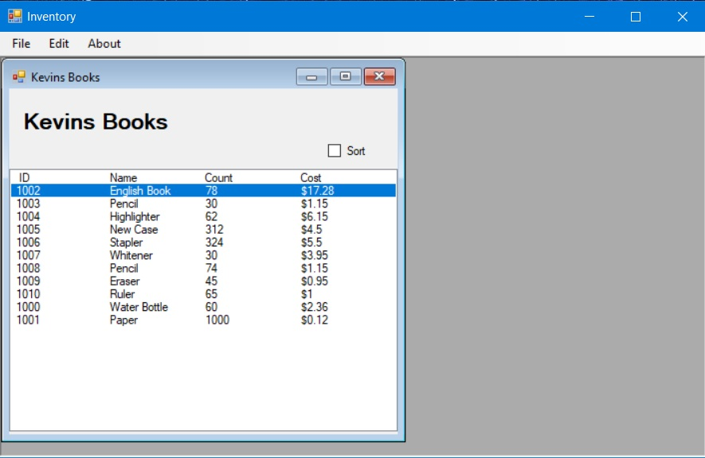
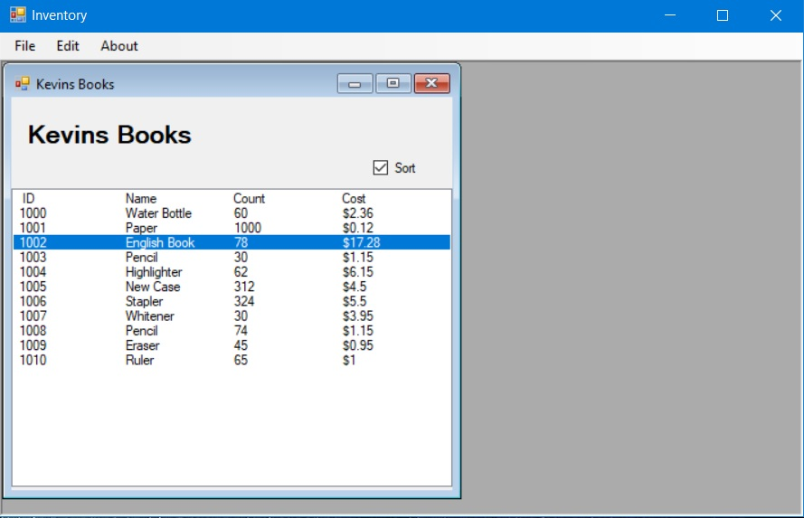
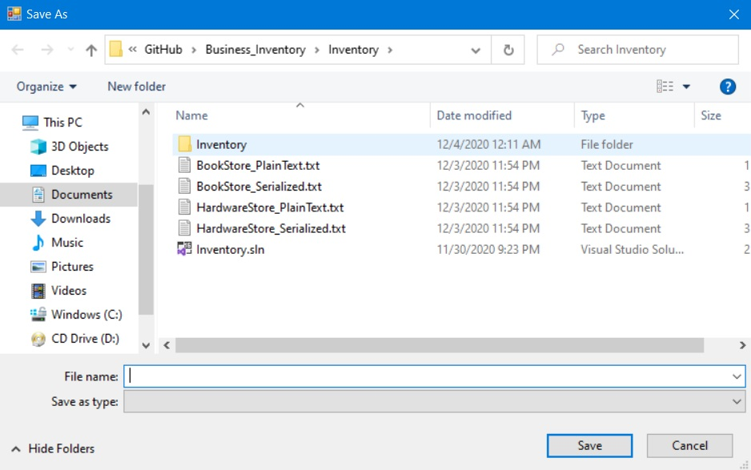
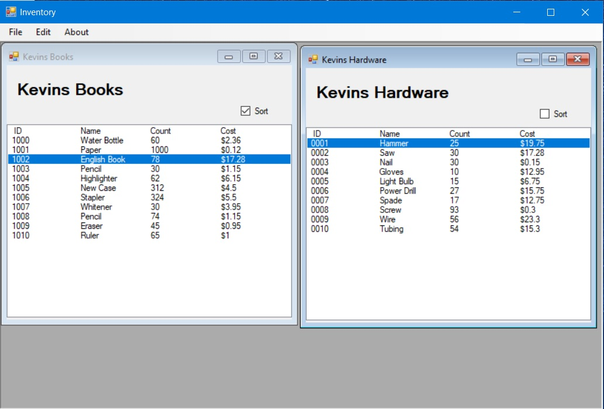 
